# Vehicle Accidents Pipeline - Cobli Case

Este repositório contém o código de um pipeline de ETL desenvolvido no Apache Airflow para processar dados de acidentes de veículos. O pipeline realiza uma série de transformações para extrair, limpar, transformar e enriquecer os dados, preparando-os para uso em análises posteriores.

## Estrutura do Pipeline

O pipeline é composto por várias tarefas (tasks) que são executadas sequencialmente. Cada tarefa representa uma etapa do processo de ETL. A DAG chamada `vehicle_accidents_cobli` orquestra a execução das tarefas no Airflow.


## Requisitos

Para executar este pipeline, é necessário ter o Apache Airflow configurado e em execução. Além disso, as dependências do projeto devem ser instaladas, conforme descrito na seção de [Instalação](#instalação).


## Instalação

1. Instale o Apache Airflow seguindo a [documentação oficial em ambiente docker](https://airflow.apache.org/docs/apache-airflow/stable/howto/docker-compose/index.html).
2. Configure a conexão com o sistema de arquivos (`file_conn`) para que o arquivo possa ser detectado na entrada.
3. Clone este repositório:
   ```bash
   git clone https://github.com/mateusfgomes/vehicle-accidents-pipeline.git
4. De forma a criar todos diretórios necessários para a correta execução, antes de usar o comando `docker compose up`, realize um `docker compose build` para que o Dockerfile seja executado anteriormente.
5. Realize o seguinte comando em um ambiente virtual:
`pip install -r requirements.txt`

### Estrutura de Arquivos
* `dags/`: Contém o arquivo principal da DAG.
* `scripts/`: Contém os scripts Python utilizados nas tarefas do pipeline.

### Exploração do dataset (Databricks - extra)

Antes de realizar todas as transformações necessárias, e posterior implementação das dags no airflow, foi realizada uma exploração do conjunto de dados por meio da plataforma Databricks. Dessa forma, foi possível extrair insights melhores sobre o tema que os dados tratavam, e obter um panorama mais claro em relação a limpeza e estruturação dos dados. Tal notebook do databricks encontra-se disponível no repositório.

### Execução das Tasks

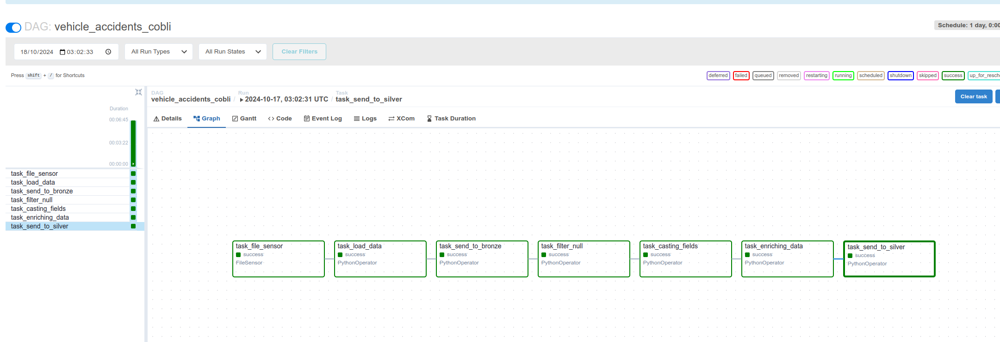

1. **File Sensor (`task_file_sensor`)**  
   Monitora a existência do arquivo `acidentes_brasil.csv`. Quando o arquivo é detectado, a execução do pipeline é iniciada.
   - **fs_conn_id**: Identificador da conexão do sistema de arquivos.
   - **filepath**: Caminho para o arquivo de entrada.
   - **poke_interval**: Intervalo de tempo, em segundos, para verificar a existência do arquivo.

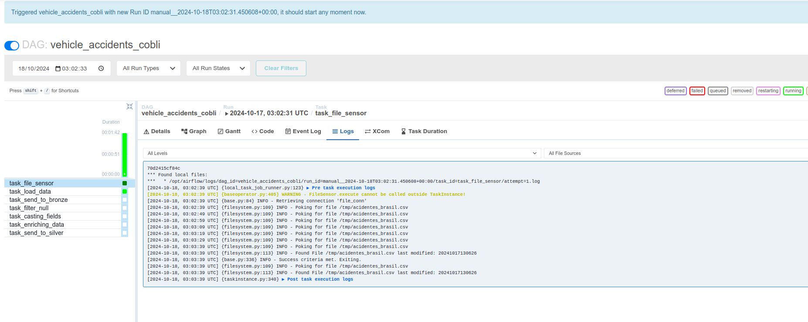

2. **Load Data (`task_load_data`)**  
   Carrega os dados do arquivo CSV (acidentes_brasil.csv) para o pipeline, convertendo-os para um DataFrame do Spark. Durante essa etapa, os dados são carregados para um diretório temporário na pasta /tmp/bronze/car_accidents, com partição por ano e estado (UF).

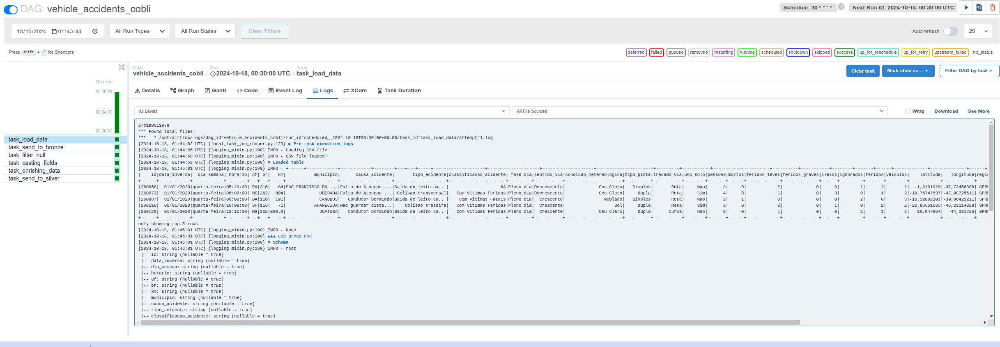
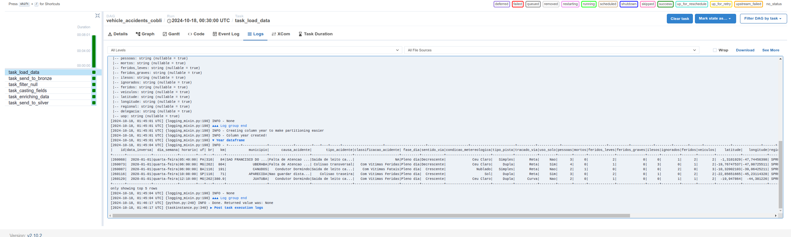
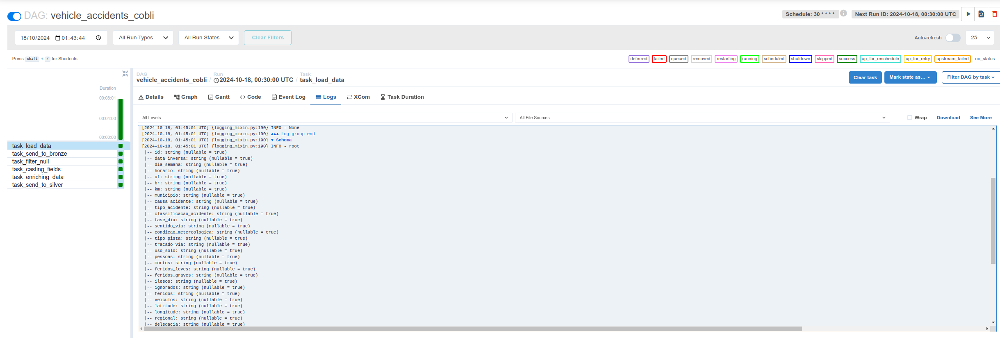

3. **Send to Bronze (`task_send_to_bronze`)**  
   Envia os dados carregados para a camada Bronze, que é a primeira camada de armazenamento no pipeline de dados. E, como esta etapa normalmente envolve o armazenamento dos dados brutos em um data lake, nesse caso, ela ficou bastante enxuta, pois a camada é apenas um diretório. Mas nada impediria a utilização de conexões externas, por exemplo com buckets do AWS S3 (como S3 Hook) para que essa etapa se tornasse mais elaborada. Como solicitado, os dados são movidos para a camada bronze com particionamento por ano e UF.

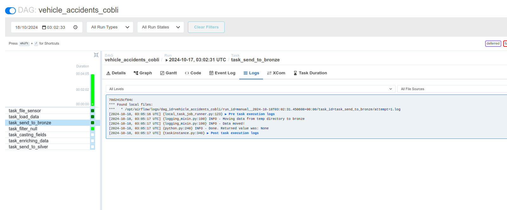

4. **Filter Null (`task_filter_null`)**  
   Realiza uma filtragem dos registros com valores nulos em qualquer coluna para garantir a integridade dos dados. Além disso, trata especificamente a coluna classificacao_acidente, substituindo valores "NA" por classificações mais adequadas, baseadas no número de vítimas fatais e feridos. Os dados filtrados são salvos em uma camada temporária também (/tmp/silver/car_accidents_filtered), antes de serem enviados para a camada silver.

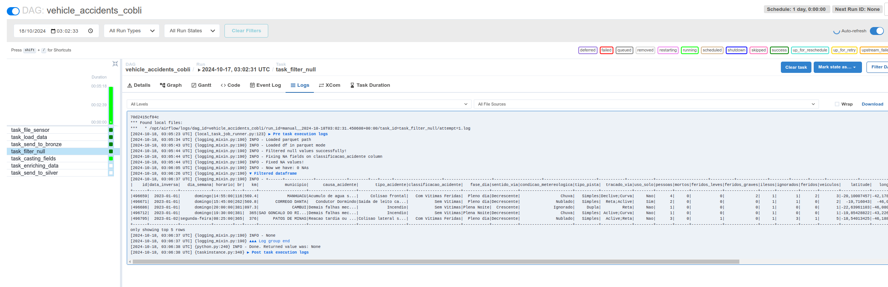

5. **Casting Fields (`task_casting_fields`)**  
   Esta tarefa faz a conversão dos tipos de dados para garantir que cada campo esteja no formato adequado. Campos como id, br, km, entre outros, são convertidos para seus respectivos tipos numéricos, e campos de data e hora são ajustados para os formatos DateType e TimestampType. Também há correção nos campos latitude e longitude para substituir vírgulas por pontos. Os dados convertidos são armazenados temporáriamente novamente em /tmp/silver/car_accidents_casted, com partição por ano.
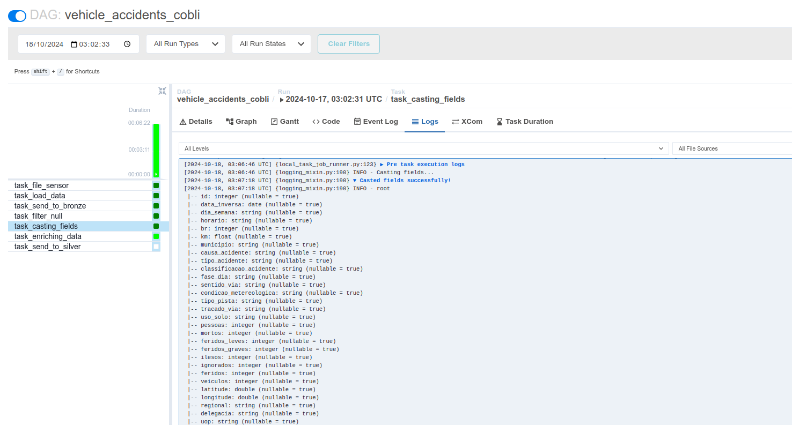
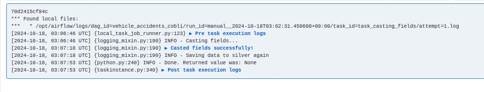

6. **Enriching Data (`task_enriching_data`)**  
   Nesta etapa, os dados são enriquecidos com o cálculo de novas colunas, como o percentual_fatalidades, que representa a porcentagem de mortos em relação ao número total de pessoas envolvidas em cada acidente. Os dados enriquecidos são salvos na pasta /tmp/silver/car_accidents_enriched com compressão Snappy, e são particionados por ano.
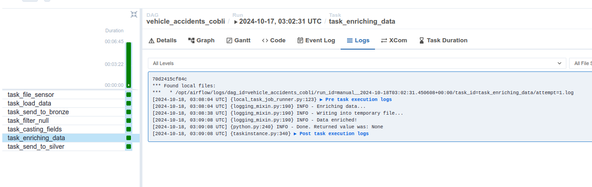


7. **Send to Silver (`task_send_to_silver`)**  
   Move os dados enriquecidos da pasta temporária para o diretório datalake/silver, particionados apenas por ano. Finalizando o fluxo.

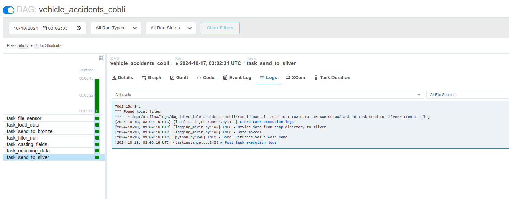